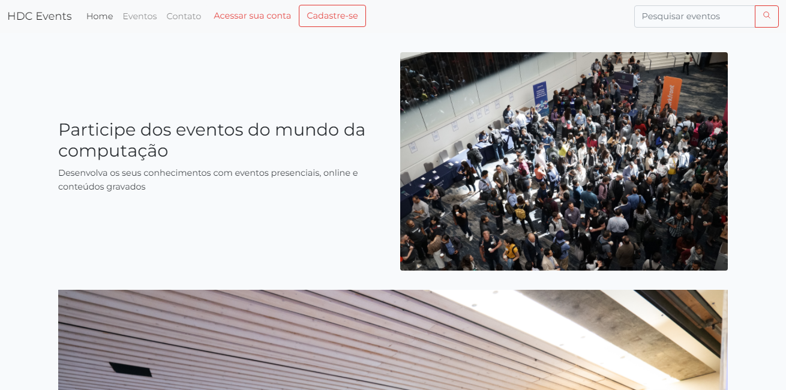

# HDC Events
> Blog desenvolvido em utlizando laravel, sob as orientações de [Matheus Battisti](https://www.youtube.com/channel/UCDoFiMhpOnLFq1uG4RL4xags) em seu [Curso de Laravel](https://www.youtube.com/playlist?list=PLnDvRpP8BnewYKI1n2chQrrR4EYiJKbUG)



## Requisitos
- PHP
- Composer
- MySQL

## Instalação do projeto
Acesse a pasta principal do projeto através do terminal, e instale as dependências usando o composer e o NPM.

```sh
composer update
npm install
```

Utilize o comando `php artisan serve` para executar o projeto

## Sobre
O HDC Events é um site de eventos, que possui uma área de exibição de eventos disponível ao usuário e também uma área administrativa para o gerenciamento de eventos, estabelecimentos e usuários.